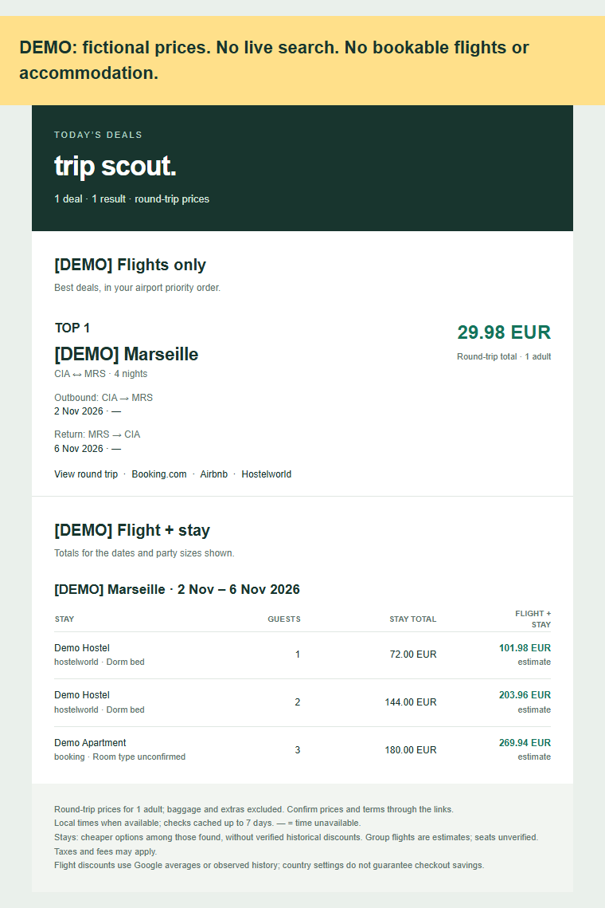

# Trip Scout

**A daily email to help you decide where to go: cheap return flights and matching stays for 1, 2 or 3 travelers.**



Python · GitHub Actions · SerpApi · Resend

[Offline demo](docs/email-demo.html) · [MIT license](LICENSE) · [Privacy and recovery](docs/privacy.md) · [Source research](docs/research.md)

## Built with AI

This project was built entirely with the assistance of **GPT 6.1 Sol**, including the implementation, email design, tests and documentation.

## Try it without keys

```sh
python -m pip install -e '.[test]'
python run.py --dry-run --fixture tests/fixtures/fares.json --stay-fixture tests/fixtures/stays.json
```

Open `output/demo-trips.html`: fictional prices, disabled booking links, no API calls and no email.

## Real searches

Copy `.env.example` to `.env` (ignored by Git):

```dotenv
ORIGIN_AIRPORTS=FCO,CIA,NAP
SERPAPI_API_KEY=your_free_plan_key
RESEND_API_KEY=your_resend_key
EMAIL_FROM=Trip Scout <trips@your-verified-domain.com>
EMAIL_TO=you@example.com
ENABLE_LLM_SUMMARY=false
```

Register for [SerpApi's free plan](https://serpapi.com/pricing) and create a [Resend API key](https://resend.com/docs/dashboard/api-keys/introduction). Resend's test sender `Trip Scout <onboarding@resend.dev>` can send to your Resend account email; other recipients require a verified sender domain. Existing account keys can be reused; another repository's GitHub secrets are not shared automatically.

```sh
python run.py --dry-run
python run.py
```

Dry runs send no email and preserve alert history, but live API calls consume free searches and persist quota reservations. Inspect `output/trips.html` and `output/diagnostics.json`. Emails highlight the top 5 bargains, then include other qualifying routes and all remaining observed fares. Outbound and return routes/dates appear together; verified times are added when a detail lookup matches both legs at the same rounded total. Missing times remain explicit.

## Cheap means below a benchmark

Flights must be at least **30% below Google's reported average** and within your budget. The benchmark is named in the email. Keyless Ryanair builds a baseline from seven prior scan days for the same route, departure month and trip length; new routes do not immediately qualify.

Accommodation shows the cheapest usable options returned, rather than independently proven historical discounts. **There is no default lodging or combined-trip price cap.** You can set optional limits yourself. Quotes require matching dates and occupancy. Group flights are solo fare × travelers estimates, without verified seat availability. Confirm baggage, taxes, room type and checkout prices before booking.

The digest has **Flights only** and **Flight + stay** sections. Repeat-alert tracking does not hide researched accommodation from the digest. Only new bargains or sufficient price drops advance baselines, after Resend acceptance. Pending delivery has idempotent retries; acceptance does not guarantee inbox delivery.

## Coverage and free limits

- **Once daily at 05:17 UTC**: 07:17 summer Rome time, 06:17 winter. GitHub schedules may be delayed.
- Departure and return within **365 days**. Two 30-day windows per scan, spread across the year; six scans cover twelve windows. Additional cycles cover every airport/market combination.
- First airport in `ORIGIN_AIRPORTS` searched every scan and ranked first; others rotate in the second window. Use airport IATA codes, not city code `ROM`.
- Country settings `it,de` rotate with EUR fixed; cheapest observed equivalent route/date result retained. Other markets are configurable. The US setting was removed from defaults after a live comparison returned an unresolved FCO airport and no fares, while the same dates with DE returned 30 fares. Google localization does not change IP/residency or guarantee country-specific checkout savings.
- Only an Account API verified active, zero-price **Free** SerpApi plan is accepted. Hard ceiling **200 reservations per billing cycle**, with 10 provider credits reserved. Requests reserve quota before execution, including failures/manual runs. Paid or unverified plans fall back to Ryanair. Nothing buys credits or upgrades accounts.
- Default maximum: 2 flight discovery + 2 schedule + 2 hotel requests/day = **186 in a 31-day month**. Cache/direct quotes reduce this. Preserve usage state.
- **No Apify**, paid scraper or proxy. Groq optional, disabled by default. Resend/GitHub have their own account allowances; check your plans.

## Accommodation status

| Source | Automatic dated prices | Limits |
| --- | --- | --- |
| Airbnb | Unofficial direct adapter, explicit totals | Price-filtered first page; can change/block hosted runners |
| Booking.com | HTML adapter when accessible | Often HTTP 202 challenge; no bypass |
| Google Hotels | Same free SerpApi key, full-stay totals only | Up to 2 fallback queries/scan; room type may be unknown |
| Hostelworld | Manual link | Catalog rates do not prove dated availability; automatic feed needs partner access |
| Hostelz | Manual comparison | No automatic price feed |

Dorm/shared rooms are allowed when identifiable. A hostel name does not prove a price buys a dorm bed. Google Hotels may find hostels without identifying their room types. Group searches can be deferred by query limits. Missing stays do not block flight emails.

Each trip records **usable quotes vs. quotes within budget**, alongside source errors. No combined proposal can mean blocked access, unsupported formats, above-budget prices or deferred searches. Empty direct results are not reused as successful cached quotes for 24 hours.

## Configuration

Edit `config/settings.json`; `.env`/Actions `ORIGIN_AIRPORTS` overrides airports.

| Setting | Default |
| --- | --- |
| `origins` | FCO, CIA, NAP, in priority order |
| `min_days_ahead`, `max_days_ahead` | 7, 365 |
| `min_nights`, `max_nights` | 2, 5 |
| `min_discount_percent`, `max_price` | 30%, `null` = no absolute flight cap |
| `destinations`, `excluded_destinations` | Optional airport allowlist/blocklist |
| `destination_price_limits` | Optional per-airport budgets |
| `max_deals_per_email`, `highlighted_deals` | 0 = all; top 5 highlighted |
| `max_schedule_checks_per_scan` | 1 itinerary, up to 2 requests |
| `accommodation.party_sizes` | 1, 2, 3; first is primary alert occupancy |
| `accommodation.max_nightly_price`, `max_trip_price` | `null` = no cap; optional per-person limits |
| `accommodation.max_trips_per_scan` | 3 city/date combinations |
| `accommodation.max_options_per_trip` | 1 result per occupancy |
| `accommodation.max_google_queries_per_scan` | 2; 0 disables |
| `accommodation.include_shared`, `cache_hours` | true, 24 hours |

`python run.py --dry-run --full-scan` checks all departure windows now, within the same free cap; coverage is not exhaustive across dates/airlines/countries.

## GitHub Actions setup

1. Fork/push the code and install locally.
2. Create this repository's environment **base**. Add secrets `RESEND_API_KEY`, `EMAIL_FROM`, `EMAIL_TO`, `SERPAPI_API_KEY` for your free plan; optional `GROQ_API_KEY`.
3. Add variable `ORIGIN_AIRPORTS`, e.g. `FCO,CIA,NAP`. Optional: `ENABLE_LLM_SUMMARY`, `GROQ_MODEL`.
4. Generate `STATE_ENCRYPTION_KEY` following [the privacy guide](docs/privacy.md). Save it privately in `.env` and as a `base` secret. Run `python scripts/initialize_state.py` once, then commit `runtime/` on `main` and push. A fork initializes its own archive and installation identity; it does not use the original repository's encrypted history. Existing local data is preserved. Reinitializing the same installation is refused.
5. Allow Actions write access to contents on **main**. Run **Trip Scout alerts** with `dry_run=true`, download/decrypt its report, then disable dry run to send email.

Scans store quota/history/cache in **`runtime/state.enc` on main**, including failures and dry runs. Plaintext runtime files are ignored. Each scan adds a normal encrypted-state commit on main; it does not rewrite your code commits. There is no separate state branch. Reports are encrypted artifacts retained 14 days. Logs omit itinerary tables. Missing keys/invalid archives stop scanning rather than reset state. Keep a private key backup. [Recovery and privacy details](docs/privacy.md).

## Development

```sh
python -m pytest -q
```

Offline tests cover quota guards, round-trip matching, group totals, escaping and encrypted state recovery. Pull requests receive no production secrets. Experimental project: coverage is partial and unofficial adapters can break.
